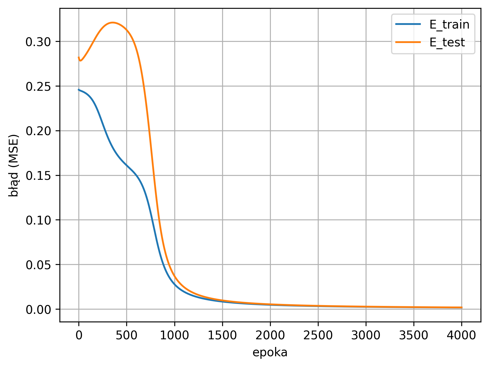
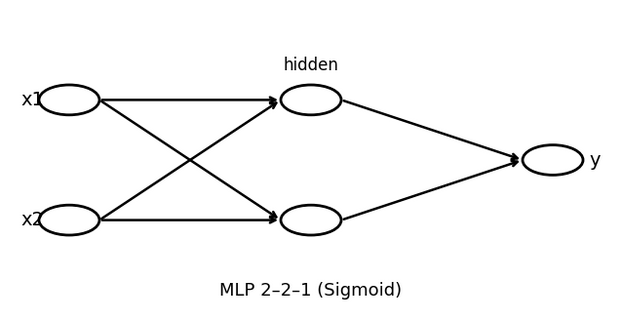

Made with ☕ + PyTorch

# 🧠 XOR Gate with a Tiny MLP (PyTorch)

This repo is a short, practical exercise: train a tiny **MLP** to learn the **XOR** logic gate.
XOR is the classic example where a single neuron (perceptron) fails, so we need at least one hidden layer.

---

## ✅ What’s inside

- a small PyTorch MLP (**2–2–1**) with **sigmoid** activations  
- training with **SGD** + **MSE loss**  
- a simple **80/20 train–test split** (the XOR samples are repeated only to make the split possible)
- printed logs during training + final predictions for the 4 XOR inputs
- plots saved for the report (loss curve + network sketch)

---

## 🖼️ Screenshots

**Loss curve (train vs test):**  

**Network diagram (MLP 2–2–1):**  

---

## 📊 Results (example run)

After training, the network predicts values close to 0 or 1.  
Using a threshold of **0.5**, all 4 XOR cases are classified correctly:

| x1 | x2 | target (t) | output (y) | class |
|---:|---:|-----------:|-----------:|------:|
| -1 | -1 | 0 | 0.0457 | 0 |
| -1 |  1 | 1 | 0.9630 | 1 |
|  1 | -1 | 1 | 0.9620 | 1 |
|  1 |  1 | 0 | 0.0434 | 0 |

A few loss checkpoints from the same run:

- epoch 0: `E_tr=0.2457`, `E_te=0.2818`  
- epoch 1000: `E_tr=0.0278`, `E_te=0.0370`  
- epoch 3500: `E_tr=0.0020`, `E_te=0.0022`

---

## 🧩 XOR dataset

Inputs follow the convention used in the lecture slides:

- **0 → -1**
- **1 →  1**

Truth table:

| x1 | x2 | XOR |
|---:|---:|---:|
| -1 | -1 |  0 |
| -1 |  1 |  1 |
|  1 | -1 |  1 |
|  1 |  1 |  0 |

---

## 🏗️ Model architecture

**2–2–1 MLP** (minimal setup that can represent XOR):

- 2 inputs  
- 2 hidden neurons (sigmoid)  
- 1 output neuron (sigmoid)

> In the slides bias is shown as an extra input equal to 1.  
> Here it’s handled automatically by `nn.Linear`, so the input vector stays 2D.

---

## ⚙️ Hyperparameters

All values are grouped at the top of the script:

- `SEED` – only if you want repeatable runs  
- `POWIELENIE` – repeats the 4 XOR samples to allow an 80/20 split  
- `LR` – learning rate  
- `EPOCHS` – training epochs  
- `TRAIN_SPLIT` – train/test ratio  
- `H1` – hidden layer size (2 for the “minimal XOR” network)
